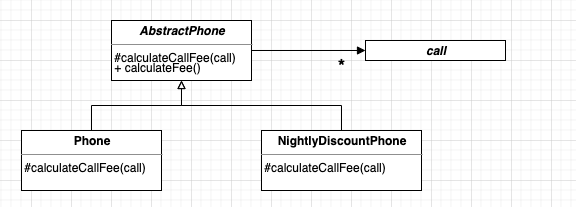
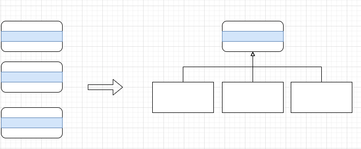

# chapter 10. 상속과 코드 재사용

## 01. 상속과 중복코드

### DRY 원칙

**Don't Repet Yourself**

* 반복하지 마라 
* 중복 여부를 판단하는 것은 변경이다. 요구사항이 변경되었을때 같이 수정되어야 하면 중복이다. 
* 모양이 유사하다고 중복은 아니다.


### 중복과 변경

#### 중복 코드 살펴보기

#### 중복 코드 수정하기

#### 타입 코드 사용하기

```java
enum PhoneType {REGULAR, NIGHTLY}

public Money calculateFee {
  if(type === PhoneType.REGULAR) {
    ...
  } else{
    ...
  }  
}

```

### 상속을 이용해서 중복 코드 제거하기


### 강하게 결합된 Phone 과 NightlyDiscountPhone


**상속을 위한 경고1**

> 자식 클래스의 메서드 안에서 super 참조를 이용해 부모 클래스의 메서드를 직접 호출할 경우 두 클래스는 강하게 결합된다. Super 호출을 제거할 수 있는 방법을 찾아 결합도를 제거하라.


## 02. 취약한 기반 클래스 문제

* 상속은 자식 클래스와 부모 클래스의 결합도를 높인다. 
* 부모 클래스의 변경에 의해 자식 클래스가 영향을 받는 현상 : `취약한 기반 클래스 문제`

객체지향의 기반은 캡슐화를 통한 변경의 통제다. 

상속은 코드의 재사용을 위해 캡슐화의 장점을 희석시키고 구현에 대한 결합도를 높임으로써 객체지향이 가진 강력함을 반감시킨다.

### 불필요한 인터페이스 상속 문제

**상속을 위한 경고2**

> 상속받은 부모 클래스의 메서드가 자식 클래스의 내부 구조에 대한 규칙을 깨뜨릴 수 있다.


### 메서드 오버라이딩의 오작용 문제

**상속을 위한 경고 3**

> 자식 클래스가 부모 클래스의 메서들르 오버라이딩할 경우 부모 클래스가 자신의 메서드를 사용하는 방법에 자식 클래스가 결합될수 있다.


### 부모 클래스와 자식 클래스의 동시 수정 문제

**상속을 위한 경고 4**

> 클래스를 상속하면 결합도로 인해 자식 클래스와 부모 클래스의 구현을 영원히 변경하지 않거나, 자식 클래스와 부모 클래스를 동시에 변경하거나 둘 중 하나를 선택할 수 밖에 없다.

## 03. Phone 다시 살펴보기

### 추상화에 의존하자

**코드 중복을 제거하기 위해 상속을 도입할 떄 따르는 두가지 원칙** 

* 두 메서드가 유사하게 보인다면 차이점을 메서드로 추출하라. 메서드 추출을 통해 두 메서드를 동일한 형태로 보이도록 만들수 있다.
* 부모 클래스의 코드를 하위로 내리지 말고 자식 클래스의 코드를 상위로 올려라. 부모 클래스의 구체적인 메서드를 자식 클래스로 내리는 것 보다 자식 클래스의 추상적인 메서드를 부모 클래스로 올리는 것이 재사용성과 응집도 측면에서 더 뛰어난 결과를 얻을 수 있다.


### 차이를 메서드로 추출하라.

### 중복 코드를 부모 클래스로 올려라


**리팩토링 후 상속 계층**




### 추상화가 핵심이다

* **AbstractPhone** 은 전체 통화 목록을 계산하는 방법이 바뀔 경우만 변경된다.
* **Phone** 은 일반 요금제의 통화 한건을 계산하는 방법이 바뀔 경우 변경된다.
* **NightlyDiscountPhone** 은 심야 할인 요금제의 통화 한건을 계산 하는 방법이 바뀔 경우 변경된다. 
* 세 클래스는 각각 하나의 변경 이유만을 가진다. **단일 책임 원칙**을 준수하기 때문이다.


### 의도를 드러내는 이름 선택하기

**Phone -> RegularPhone으로 이름 변경** 

### 세금 추가하기

객체 생성 로직의 변경에 대한 변경을 막기보다는 핵심 로직의 중복을 막아라. 핵심 로직은 한곳에 모아 놓고 조심스럽게 캡슐화 해야한다.


## 04. 차이에 의한 프로그래밍

기존 코드와 다른 부분만을 추가함으로써 애플리케이션의 기능을 확장하는 방법을 **차이에 의한 프로그래밍** 이라고 한다.

차이에 의한 프로그래밍의 목표

* 중복 코드를 제거
* 코드 재사용


**재사용가능한 코드란?**

* 심각한 버그가 존재하지 않는 코드. 
* 코드를 재사용 하면 코드의 품질은 유지하면서 코들르 작성하는 노력과 테스트는 줄일 수 있다. 

**중복 코드를 제거하고 재사용할수 있는 가장 유명한 방법은 상속이다.** 

1. 중복 코들르 하나의 클래스로 모은다.
2. 원 클래스에서 중복 코드를 제거한 후 옮겨진 클래스를 상속 관계로 연결한다. 


**상속을 이용한 중복 코드 제거 방법**




상속이 코드 재사용 측면에서 매우 강력한 도구이지만 잘못 사용할 경우 돌아오는 피해 역시 크다. 

상속의 오용과 남용은 애플리케이션을 이애하고 확장하기 어렵게 만든다. 

`정말로 필요한 경우에만 상속을 사용하라. `


